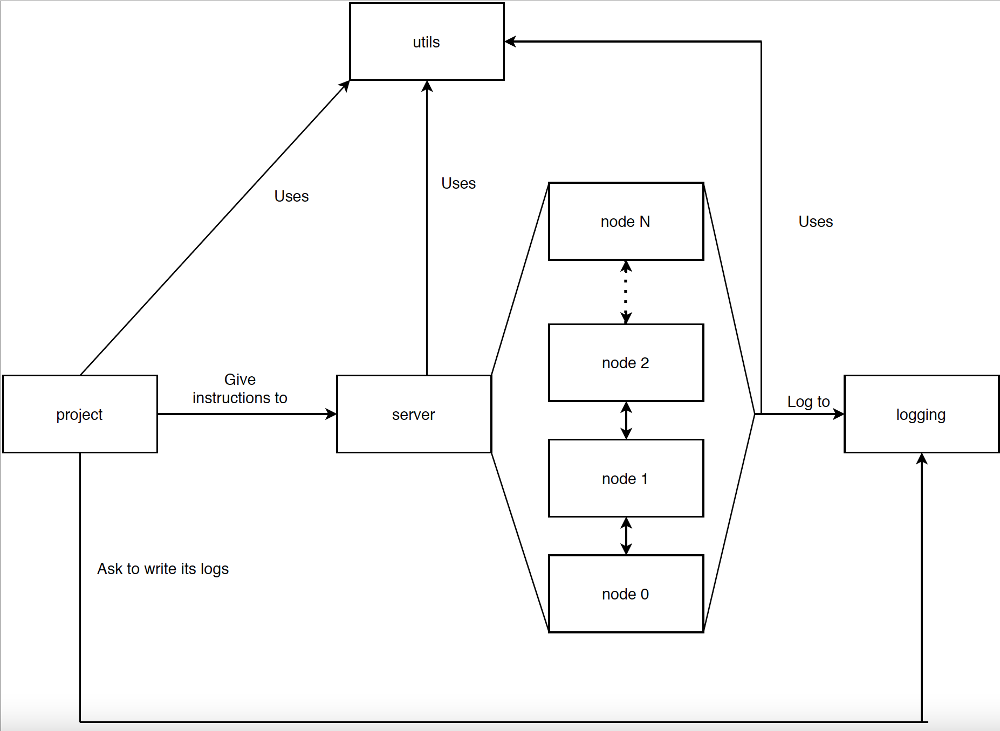

# Project: The Peer Sampling service

## Introduction

In this project, we were asked to implement a gossip algorithm (with the help of this paper https://dl.acm.org/doi/10.1145/1275517.1275520) using the message passing model in Erlang.
At the end, I was able to implement the gossip algorithm using a double-list structure, log all useful information and the required scenarios. However, due to some issues and the complexity of relearning functional programming, I did not manage to provide the graphs showing the convergence of the algorithm.

## Components and architecture

Note : in this report, I will not give the specifications of all function since it is already done in the code.


### project.erl
This module is responsible for generating a scenario and is the module called in my bash script. It takes all the needed parameters (gossip related, number of nodes, timer,...) to generate this scenario. For generating the scenario (as described in the instructions), it spawns a server and a logging service and then give its instructions to them to simulate the gossip algorithm.

### server.erl
This module manages all the node and implements the double linked-list to give their initial view to them. It can receive a whole lot of different messages and apply them to its nodes to simulate certain behaviours. For instance, it can add a node, crash a specific number of nodes, initialise the view of its nodes, activate its nodes, ask the (alive) nodes to do their active thread,...

### node.erl
This module represents a node with the ability to perform the gossip algorithm. A node can be in 3 states , unassigned, inactive and active. When a node is initialised (init function), it is in unassigned state and can't do anything until it receives its ID (attributed by the server). Once it received its ID, it goes to the inactive state. This state represents a node that has not started yet or is crashed, it discards every message from other nodes and can only be activate by the server or get a new view attributed to it (useful when we need to set the initial view or a new view after a crash). When the node gets activated, it can perform the gossip algorithm; it is able to reply to other nodes with its passive thread (based on the gossip parameters that were given to it) or do its active thread if the server asks it to.
The view of a node is a list composed of tuple {Id, Pid, Age}. A node keeps also track of its cycle number (incremented every-time it runs its active thread) and logs to the logging process its Cycle number, Id and view as asked in the instructions.

### utils.erl
This modules is used by the other one for its useful methods (especially the one related to the gossip algorithm), the functions related to peer selection, and so one are implemented there.

### logging.erl
This module is used to keep track of the state of the nodes before they execute their active thread. It can also write all its logs to an output file if asked by the project module.
A log is a list of tuple {Cycle, Id, View} and when outputed, is of the format
CYCLE - NODEID : VIEW\n

Important : I decided that each node has its own cycle number (starts at 0 when initialized). Therefore, it is possible that a node is at cycle 50 while another is just at cycle 10 if the second one has been created after the first one for instance.

## How to run

### Scenario 1 and 2
Note : scenario 1 uses healer policy and scenario 2 uses swapper policy. To see all the parameters used, go to the launch_scenario_1/0 function in project.erl.

A bash script has been done to execute both scenario asked in the instructions. To execute it, given that Erlang is installed on your machine, you just have to execute : 
```
./scenario1.sh
```
or
```
./scenario2.sh
```
at the root of this repository.
The logs of those scenarios can be found in ./src/scenarioX_logs.txt (the file is overwritten if the scenario is launched).

### Custom scenario
To run a scenario with custom gossip parameters, run the following at the root of the project :
```
./compile.sh
cd src
erl
project:launch([NUMBER OF NODES], [NUMBER OF CYCLES], [CYCLE TIME IN MS], [PULL?], [VIEW SIZE], [VIEW SELECTION POLICY], [PEER SELECTION POLICY], [OUTPUT LOGFILE NAME])
```
The valid values for the parameters above are described in the project.erl file (in the specification of the launch/8 function).
An exemple of a valid last command is
```
project:launch(128, 180, 3000, false, 7, healer, tail, "logs.txt").
```

### Unit test for server
I have made a simple test that add an element to the server 3 times and prints the list between each addition, it can be run by running at the root of the project : 
```
./serverunittest.sh
```
Due to concurrency problem, the output of this program will probably be a bit messed up. However, after analysing it, I'm really confident that my double linked list is working properly.

## Logs analysis

Based on the logs, I think my gossip algorithm is working properly. We can clearly see the correctness of the initial views (on start and on recovery) and the convergence of the view if we track a node. Sadly, I did not manage to exploit those logs to create the 2 required graphs by lack of time.